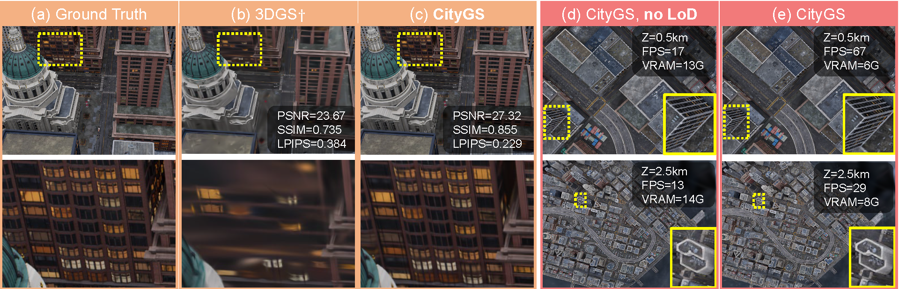
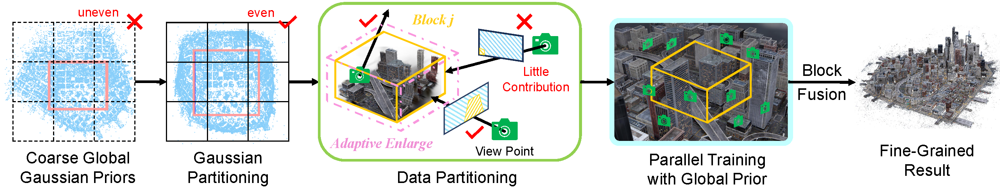
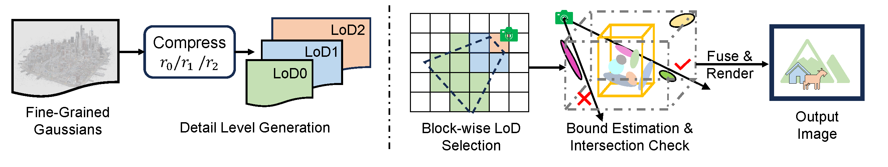

<br>
<p align="center">
<h1 align="center"><strong>[ECCV2024] CityGaussian: Real-time High-quality Large-Scale Scene Rendering with Gaussians</strong></h1>
  <p align="center">
    Yang Liu&emsp;
    He Guan&emsp;
    Chuanchen Luo&emsp;
    Lue Fan&emsp;
    Naiyan Wang&emsp;
    Junran Peng&emsp;
    Zhaoxiang Zhang&emsp;
    <br>
    <em>Institute of Automation, Chinese Academy of Sciences; University of Chinese Academy of Sciences</em>
    <br>
  </p>
</p>

<div id="top" align="center">

[](https://arxiv.org/pdf/2404.01133)
[](https://dekuliutesla.github.io/citygs/)


</div>

The advancement of real-time 3D scene reconstruction and novel view synthesis has been significantly propelled by 3D Gaussian Splatting (3DGS). However, effectively training large-scale 3DGS and rendering it in real-time across various scales remains challenging. This paper introduces CityGaussian (CityGS), which employs a novel divide-and-conquer training approach and Level-of-Detail (LoD) strategy for efficient large-scale 3DGS training and rendering. Specifically, the global scene prior and adaptive training data selection enables efficient training and seamless fusion. Based on fused Gaussian primitives, we generate different detail levels through compression, and realize fast rendering across various scales through the proposed block-wise detail levels selection and aggregation strategy. Extensive experimental results on large-scale scenes demonstrate that our approach attains state-of-the-art rendering quality, enabling consistent real-time rendering of large-scale scenes across vastly different scales. **Welcome to visit our [Project Page](https://dekuliutesla.github.io/citygs/)**.

<!--  -->

<div style="text-align: center;">
    
</div>

## 📰 News
**[2024.10.12]** Checkpoints on main datasets have been released!

**[2024.10.11]** Updates FAQ! If you are stucked, please first check whether it can solves the problem.

**[2024.08.20]** Updates [Custom Dataset Instructions](doc/custom_dataset.md)! 

**[2024.08.05]** Our code is now available! Welcome to try it out!

**[2024.07.18]** Camera Ready version now can be accessed through arXiv. More insights are included.

## 🥏 Model of CityGaussian

This repository contains the official implementation of the paper ["CityGaussian: Real-time High-quality Large-Scale Scene Rendering with Gaussians"](https://arxiv.org/pdf/2404.01133). Star ⭐ us if you like it!
### Training Pipeline
<p align="center">
  
</p>

### Rendering Pipeline
<p align="center">
  
</p>

## 🔧 Usage

Note that the configs for five large-scale scenes: MatrixCity, Rubble, Building, Residence and Sci-Art has been prepared in `config` folder. Data of these datasets can be prepared according to [Data Preparation](doc/data_preparation.md). For COLMAP, we recommend to directly use our generated results:

- **Google Drive**: https://drive.google.com/file/d/1Uz1pSTIpkagTml2jzkkzJ_rglS_z34p7/view?usp=sharing
- **Hugging Face**: https://huggingface.co/datasets/dylanebert/CityGaussian
- **Baidu Netdisk**: https://pan.baidu.com/s/1zX34zftxj07dCM1x5bzmbA?pwd=1t6r

### Checkpoints
Please download from:
- **Hugging Face**: https://huggingface.co/TeslaYang123/CityGaussian
- **Baidu Netdisk**: https://pan.baidu.com/s/1a9C8xgAQmQy86FvO9XXBFQ?pwd=cxlr 

### Installation
#### a. Clone the repository
```bash
# clone repository
git clone --recursive https://github.com/DekuLiuTesla/CityGaussian.git
cd CityGaussian
mkdir data  # store your dataset here
mkdir output  # store your output here
```

#### b. Create virtual environment
```bash
# create virtual environment
conda create -yn citygs python=3.9 pip
conda activate citygs
```

#### c. Install PyTorch
* Tested on `PyTorch==2.0.1`
* You must install the one match to the version of your nvcc (nvcc --version)
* For CUDA 11.8

  ```bash
  pip install torch==2.0.1 torchvision==0.15.2 torchaudio==2.0.2 --index-url https://download.pytorch.org/whl/cu118
  ```

#### d. Install requirements
```bash
pip install -r requirements.txt
```

#### e. Install tailored LightGaussian for LoD
```bash
cd LargeLightGaussian
pip install submodules/compress-diff-gaussian-rasterization
ln -s /path/to/data /path/to/LargeLightGaussian/data
ln -s /path/to/output /path/to/LargeLightGaussian/output
cd ..
```
### Prepare Config Files
If you use your own dataset, please follow instruction in [Custom Dataset Instructions](doc/custom_dataset.md) to prepare. We also prepared templates in `./config` and `LargeLightGaussian/scripts`.

### Training and Vanilla Rendering
To train a scene, config the hyperparameters of pretraining and finetuning stage with your yaml file, then replace the `COARSE_CONFIG` and `CONFIG` in `run_citygs.sh`. The `max_block_id`, `out_name`, and `TEST_PATH` in `run_citygs.sh` should be set according to your dataset as well. Then you can train your scene by simply using:
```bash
bash scripts/run_citygs.sh
```
This script will also render and evaluate the result without LoD.

### Rendering with LoD
First, the LoD generation is realized by the following command:
```bash
cd LargeLightGaussian
bash scripts/run_prune_finetune_$your_scene.sh
bash scripts/run_distill_finetune_$your_scene.sh
bash scripts/run_vectree_quantize_$your_scene.sh
cd ..
```
After that, configure the LoD setting in another yaml file. Then replace `CONFIG`, `TEST_PATH`, and `out_name` with yours in `run_citygs_lod.sh`. Then you can render the scene with LoD by using:
```bash
bash scripts/run_citygs_lod.sh
```
Note that the LoD selection is now based on Nyquist sampling rate instead of manually defined distance threshold. This modification enables better generalization and anti-aliasing performance.

### Viewer
We borrowed Web viewer from [Gaussian Lightning](https://github.com/yzslab/gaussian-splatting-lightning). Take the scene Rubble as an example. To render the scene with no LoD, you can use the following command:
```bash
python viewer.py output/rubble_c9_r4
```
To render the scene with LoD, you can use the following command:
```bash
# copy cameras.json first for direction initialization
cp output/rubble_c9_r4/cameras.json output/rubble_c9_r4_lod/
python viewer.py config/rubble_c9_r4_lod.yaml
```

## 📝 TODO List

- \[x\] First Release.
- \[x\] Release CityGaussian code.
- \[x\] Release ColMap results of main datasets.
- \[x\] Release detailed instruction for custom dataset usage.
- \[x\] Release checkpoints on main datasets.


## 📄 License

<a rel="license" href="http://creativecommons.org/licenses/by-nc-sa/4.0/"></a>
<br />
This work is under the <a rel="license" href="http://creativecommons.org/licenses/by-nc-sa/4.0/">Creative Commons Attribution-NonCommercial-ShareAlike 4.0 International License</a>.

## 🤗 Citation
If you find this repository useful, please use the following BibTeX entry for citation.
```latex
@article{liu2024citygaussian,
  title={Citygaussian: Real-time high-quality large-scale scene rendering with gaussians},
  author={Liu, Yang and Guan, He and Luo, Chuanchen and Fan, Lue and Wang, Naiyan and Peng, Junran and Zhang, Zhaoxiang},
  journal={arXiv preprint arXiv:2404.01133},
  year={2024}
}
```

## 👏 Acknowledgements

This repo benefits from [3DGS](https://github.com/graphdeco-inria/gaussian-splatting), [LightGaussian](https://github.com/VITA-Group/LightGaussian), [Gaussian Lightning](https://github.com/yzslab/gaussian-splatting-lightning). Thanks for their great work!

## ❓ FAQ
- _No available GPU or only single GPU can be used for parallel training._ This may due to lack of enough memory on the GPU. `get_available_gpu()` function in the script will only return GPU id with occupied memory less than 500M. You can rise the `mem_threshold` to 5000(M) for a looser start condition. Another way is to simply kill unnecessary progress.

- _Out of memory occurs in training._ For block_all of MatrixCity aerial view, we noticed that it may cost memory more than 24G when fine-tuning specific blocks. To finish training with limited VRAM, downsampling images or adjusting max_cache_num (we used a rather large 1024) in train_large.py can be a useful practice. This problem will be resolved in our coming V2 version.

- _Generation of COLMAP results._ We use the ground-truth poses offered by datasets and separately match the train and test sets. And this will be faster and more robust than match from scratch. But indeed it still costs a lot of time.

- _Most blocks are not trained._ The main reason here is the data assigned to most blocks are too few (<50), and to prevent overfitting these blocks won't get trained. This can be attributed to unreasonable aabb setting, please try to adjust it and see if things work.
