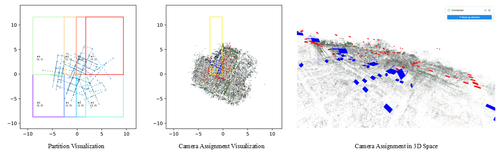

## Run & Evaluate
The detailed setting of each step on GauU-Scene and MatrixCity Dataset can be found in `./scripts/run_citygs_SCENE.sh`. 
- If applying 3DGS, please change model and renderer as done in `configs/citygs_lfls_sh2_trim.yaml` over `configs/citygsv2_lfls_sh2_trim.yaml`.
- To obtain full model, adjust SH degree to 3 and enable `diable_trimming` in renderer.
- You can also run on Mill19 or UrbanScene3D dataset by setting configs according to that of branch [V1-Original](https://github.com/DekuLiuTesla/CityGaussian/tree/V1-original).

### A. Train coarse model
```bash
# $COARSE_NAME is the name of coarse model training config file.
python main.py fit \
        --config configs/$COARSE_NAME.yaml \
        -n $COARSE_NAME \
```
### B. Model Partition and Data Assignment
```bash
# $NAME is the name of parallel tuning config file.
# to partition in contracted space, add `--contract`
# to partition after xy plane is aligned to ground plane, add `--reorient`
python utils/partition_citygs.py --config_path configs/$NAME.yaml --force
```
The command also visualizes block division and data partitioning, as like below:


### C. Finetune model parallelly and merge
```bash
python utils/train_citygs_partitions.py -n $NAME
python utils/merge_citygs_ckpts.py outputs/$NAME
```

### D. Evaluate Rendering Performance
```bash
# For finetuned model, since the split mode and eval ratios are changed for per-block tuning, the parameters have to be reappointed. Please see the script for details.
python main.py test \
        --config outputs/$NAME/config.yaml \
        --save_val \
        --test_speed \  # calculate FPS
```

### E. Mesh extraction and evaluation
```bash
python utils/gs2d_mesh_extraction.py \
        outputs/$NAME \
        --voxel_size $VOXEL_SIZE \
        --sdf_trunc $SDF_TRUNC \
        --depth_trunc $DEPTH_TRUNC \

python tools/eval_tnt/run.py \
        --scene your_gt_pcd \
        --dataset-dir data/geometry_gt/your_scene \
        --transform-path data/geometry_gt/your_scene/transform.txt \
        --ply-path "outputs/$NAME/fuse_post.ply"
```

### F. Compression
```bash
python tools/vectree_lightning.py \
        --model_path outputs/$NAME \
        --save_path outputs/$NAME/vectree \
```
If you use SH degree of 2, please add `--sh_degree 2`. And if you want to decode the quantized result to checkpoint, add `--no_save_ply`. If 3DGS is used, add `--gs_dim 3`.